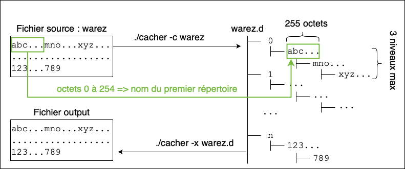

# Programmation système - Cacher le contenu d'un fichier dans une arborescence de répertoires

Complétez le programme `cacher.c` qui permet de cacher le contenu d'un fichier dans une arborescence de répertoires.
Le principe est simple : les noms des répertoires de l'arborescence sont composés des données contenues dans le fichier que l'on cherche à cacher.

Le programme admet deux modes de fonctionnement :

    ./cacher -c fichier_texte

qui permet de créer l'arborescence des répertoires à partir des données du `fichier_texte`;

    ./cacher -x arborescence fichier

qui permet de reconstituer le fichier original à partir d'une arboresence créée avec le programme `cacher`.
Les données récupérées sont écrites dans le fichier `fichier`.

**Objectifs :** savoir créer des répertoires, parcourir récursivement une arborescence et lire/écrire dans des fichiers.

## Marche à suivre

La taille maximale d'un nom de répertoire est fixée à `NAME_MAX`.
Par conséquent, chaque nom de répertoire contiendra `NAME_MAX` octets du fichier source (sauf pour le dernier répertoire si la taille du fichier source n'est pas un multiple de `NAME_MAX`).

L'arborescence devra être organisée comme suit :
- le répertoire parent aura le même nom que le fichier source avec en plus le suffixe `.d` ;
- les sous-répertoires de premier niveau seront nommés de `0` à `n` afin de pouvoir conserver l'ordre des octets dans le fichier source ;
- chaque sous-répertoire de premier niveau ne contient qu'un sous-répertoire de profondeur maximale égale à 3. Ces sous-répertoires contiennent les données du fichier.

Vous devez compléter les fonctions `encoder` (appelée avec l'option -c) et `decoder` (appelée avec l'option -x) dans le fichier `cacher.c`.
La fonction `main` est déjà écrite et ne doit pas être modifiée. 

### Exemple :

Dans l'exemple ci-dessous, l'arborescence `warez.d` est créée à partir du fichier `warez`.

Le répertoire `0` contient les octets 0 à 764 (i.e. 3 * NAME_MAX) répartis en 3 répertoires :
- les 255 premiers octets (`abc...`) constituent le nom du répertoire parent ;
- les 255 octets suivants (`mno...`) constituent le nom du sous-répertoire ;
- les 255 octets suivants (`xyz...`) constituent le nom du sous-sous-répertoire ;

On procède de même avec les répertoires `1`, `2` jusqu'à atteindre la fin du fichier source (ici les octets `789`).

Les primitives / fonctions utiles pour réaliser ce programme sont :

    int closedir (DIR *dirp)                                  // fermer un répertoire
    int mkdir (const char *path, mode_t mode)                 // création d'un répertoire
    int open (const char *path, int oflag, ...)               // ouverture d'un fichier
    DIR * opendir (const char *filename)                      // ouverture d'un répertoire
    ssize_t read (int fildes, void *buf, size_t nbyte)        // lecture dans un fichier
    struct dirent * readdir (DIR *dirp)                       // retourne un pointeur sur la prochaine entrée du répertoire
    ssize_t write (int fildes, const void *buf, size_t nbyte) // écriture dans un fichier

On rappelle que la fonction `readdir` retourne un pointeur sur une structure `struct dirent` pour un fichier contenu dans le répertoire `dirp` :

    struct dirent {
        ino_t          d_ino;       /* numéro d'inœud */
        char           d_name[256]; /* nom du fichier */
        ...
    };

Cette structure peut contenir d'autres champs mais seuls `d_ino` et `d_name` sont POSIX.
Il ne faut donc pas utiliser les autres champs sinon votre programme ne sera plus portable.

Un nouvel appel à la fonction `readdir` retourne une structure `struct dirent` sur le second fichier contenu dans le répertoire `dirp` et ainsi de suite.
Lorsque la fonction `readdir` retourne le pointeur `NULL` :
- soit tous les fichiers présents dans le répertoire ont été traités ;
- soit une erreur a été rencontrée, auquel cas `errno` a été positionné en conséquence.

Attention, le champ `d_name` de la structure `struct dirent` contient uniquement le nom du fichier, et non celui de ses potentiels répertoires parents.
Par conséquent, il faut concaténer le nom du répertoire parent avec le nom du fichier pour pouvoir travailler sur ce dernier.
Pour ce faire vous pouvez utiliser la fonction `concatener` fournie dans `cacher.c`.

Pour rappel, la taille du chemin complet d'un fichier ne peut pas dépasser `PATH_MAX` caractères.

## Test préliminaire

Les commandes suivantes créent un fichier `toto` composé de 255 'a' puis 255 'b' et 255 'c' et cache se contenu via votre programme :

    for i in `seq 1 255`; do echo -n 'a' >> toto; done
    for i in `seq 1 255`; do echo -n 'b' >> toto; done
    for i in `seq 1 255`; do echo -n 'c' >> toto; done
    ./cacher -c toto

L'arborescence suivante doit être créée :

    - toto.d
        |-0
          |-aaa...aaa
                |-bbb...bbb
                      |-ccc...ccc

Pour tester le décodage, vous pouvez utiliser les commandes :

    ./cacher -x toto.d output
    cmp toto output

La commande `cmp` compare les deux fichiers `toto` (fichier original) et `output` (produit par votre programme).
Si elle ne produit rien en sortie, c'est que le contenu des fichiers est identique et que votre programme est, a priori, fonctionnel.

## Validation
 
Votre programme doit obligatoirement passer tous les tests sur gitlab (il suffit de `commit/push` le fichier source pour déclencher le pipeline de compilation et de tests) avant de passer à l'exercice suivant.
