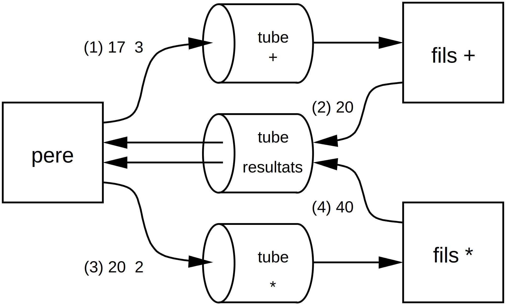

# Programmation système - Afficher des nombres premiers

Complétez le programme `calculatrice.c` qui réalise *4 opérations* sur des entiers à l'aide de processus et de tubes :

    ./calcul 17 + 3 \* 2 # * est spécial pour le Shell

Chaque opérande ou opérateur est passé comme un argument (le caractère « * » est spécial pour le Shell, il y a lieu de le neutraliser pour qu'il soit transmis tel quel au programme). On ne gérera pas les priorités des opérateurs : par exemple, l'opération « a + b $\times$ c » est calculée comme « a + b » d'abord, puis le résultat est multiplié par « c ».

Le programme doit être décomposé en 5 processus : le père crée 5 tubes et génère 4 processus distincts, un par opérateur.
Les opérandes sont passés par un tube spécifique à chaque processus opérateur, qui effectue le calcul demandé et renvoie le résultat au père par l'intermédiaire d'un tube unique pour tous les résultats.
La figure ci-dessous montre le calcul de l'exemple ci-dessus (`17 + 3 / 2`) :

1. le père écrit les deux opérandes 17 et 3 dans le tube à destination du fils traitant l'addition ;
2. celui-ci lit les deux opérandes, calcule la somme et envoie le résultat au père par le tube des résultats ;
3. le père lit le résultat 20, puis passe les deux opérandes 20 et 2 dans le tube à destination du fils traitant la multiplication ;
4. ce dernier lit les deux opérandes, calcule le produit et envoie le résultat au père par le tube des résultats ;
5. le père lit le résultat. Puisqu'il n'y a plus d'argument, le calcul peut se terminer.

**Objectifs :** savoir faire communiquer des processus à l'aide de tubes.

## Marche à suivre

Il faut dans un premier temps créer le tube anonyme pour véhiculer les résultats (depuis les processus fils vers le processus père) à l'aide de la primitive :

    int pipe (int fildes[2])

Ensuite il faut créer les 4 tubes anonymes et les 4 processus fils (chaque fils gère un opérateur) via les primitives :

    pid_t fork ()
    int pipe (int fildes[2])

On rappelle que la primitive `fork` doit obligatoirement s'utiliser dans une structure switch () :

    switch (fork ()) {
    case -1: /* erreur */
    case  0: /* processus fils */
    default: /* processus père */
    }

Vous porterez une attention particulière à fermer au plus tôt les descripteurs non utiles via la primitive :

    int close (int desc)

Le processus père doit attendre 2 secondes via la fonction `sleep()` avant de passer à la suite.

Il faut maintenant récupérer les arguments du programme (donc les opérandes et opérateurs).
On se limitera à traiter les cas simples : les arguments seront convertis en entiers avec la fonction de bibliothèque `atoi` sans chercher à vérifier la conformité des nombres.
Vous ne traiterez pas les divisions par 0.

Lorsque deux opérandes et un opérateur sont récupérés, il faut envoyer les opérandes au fils correspondant à l'opérateur via le tube adéquat avec la primitive :

    ssize_t write (int fildes, const void *buf, size_t nbyte)

Puis récupérer le résultat de l'opération sur le tube « résultats » avec la primitive :

    ssize_t read (int fildes, void *buf, size_t nbyte)

Il faut répéter ces opérations tant qu'il y a des arguments non traités.

Enfin, vous fermerez les derniers descripteurs encore ouverts (avec `close`) et le processus père doit attendre que tous les fils soient terminés pour afficher le résultat avec la primitive et les macros :

    pid_t wait (int *status)
	WIFEXITED (status)
    WEXITSTATUS (status)

Le code de retour du père doit être nul si aucune erreur n'est rencontrée par le père ou l'un des fils.

## Test préliminaire

La commande suivante :

    ./calculatrice 10 + 1 - 2 \* 3 / 4

doit produire la sortie suivante :

    6

## Validation

Votre programme doit obligatoirement passer tous les tests sur gitlab (il suffit de `commit/push` le fichier source pour déclencher le pipeline de compilation et de tests) avant de passer à l'exercice suivant.
